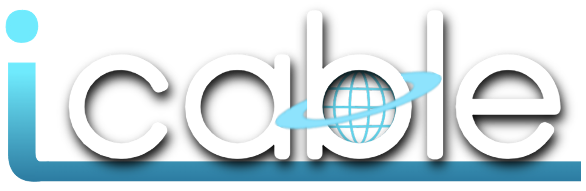

  

iCable (or Interdimensional Cable), brings you a simple and convenient solution to watch your own hosted media or external sources in an all-in-one, cable-like user interface through your web browser.

## Description
iCable has too many features to pack into this readme, but some of the best are the full personalization/customization ability, custom channels, support for all kinds of streams and content (including HLS, YouTube, and Twitch), complete privacy by storing literally ALL data within your browser storage. Plus, it's extremely easy to use and it's free AND open source.

iCable is essentially a fancy UI to watch your favorite content, with the easiest ability to customize and fine tune everything down to the letter. No data gets sent to any servers other than the servers you are streaming/accessing from. Again, it's a glorified media player.

## Usability
The guide, basic channel creation, basic system setup/settings, and the player are stable. The side menu is still in progress (widgets are still buggy), as well as the full on-demand system and other upcoming features.

I make sure to triple check everything before doing full commits of fixes/updates. Releases are/will be thoroughly checked to make sure everything is as stable as possible.

## Attributes
TMDb, OpenWeather, 

## Disclaimer

## License
This software is licensed under the GNU General Public License v3. 
